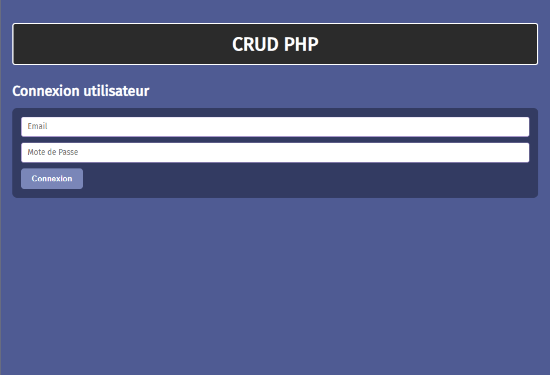
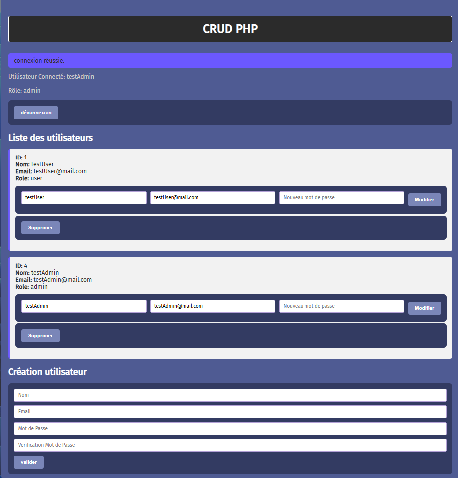

# Projet CRUD PHP

# Description

Ce projet est une application web de **gestion d’utilisateurs** réalisée en **PHP** et **MySQL** avec un design inspiré par la page web de PHP. 
Il permet à un administrateur de créer, lire, modifier et supprimer des utilisateurs.

# La sécurité est prise en compte avec :

- **Authentification utilisateur (login / logout)**

- **Gestion des rôles (admin et user)**

- **Validation côté serveur (emails et mots de passe)**

- **Hash sécurisé des mots de passe (password_hash)**

- **Protection CSRF sur tous les formulaires sensibles**

# Installation

**Cloner le projet**
Copier le dossier dans votre serveur local.

**Créer la base de données**
Nom de la base : crud_php

Exemple de table users :

CREATE TABLE `users` (
  `id` INT AUTO_INCREMENT PRIMARY KEY,
  `name` VARCHAR(255) NOT NULL,
  `email` VARCHAR(255) NOT NULL UNIQUE,
  `password` VARCHAR(255) NOT NULL,
  `role` ENUM('user','admin') DEFAULT 'user',
  `created_at` TIMESTAMP DEFAULT CURRENT_TIMESTAMP
) ENGINE=InnoDB DEFAULT CHARSET=utf8;

# Utilisation

**Connexion utilisateur**

Les utilisateurs peuvent se connecter avec email et mot de passe.

Seuls les admins peuvent accéder aux actions CRUD.

# Création d’utilisateur (Admin)

Remplir le formulaire avec nom, email, mot de passe et confirmation du mot de passe.

Protection CSRF incluse.

# Modification d’utilisateur (Admin)

Fournir l’ID de l’utilisateur, les nouvelles informations et éventuellement un nouveau mot de passe.

Protection CSRF incluse.

# Suppression d’utilisateur (Admin)

Fournir l’ID de l’utilisateur à supprimer.

Protection CSRF incluse.

# Sécurité

Mot de passe hashé avec password_hash().

Vérification côté serveur pour emails et mots de passe.

Protection CSRF : chaque formulaire contient un token unique stocké en session.

Contrôle des rôles : seules les actions admin sont autorisées pour les utilisateurs avec rôle admin.

# Structure du projet

**index.php** : page principale avec tous les formulaires et traitement PHP

**assets / style.css** : fichier CSS pour le style du projet

**Base de données MySQL** : table users

# Notes

Le projet est volontairement très simple et ne nécessite pas de JavaScript.

# Captures d'écran de l'application

# Structure des fichiers

/projet-crud-php
│
├─ index.php          # Page principale avec connexion et CRUD
├─ README.md          # Documentation
└─ assets/ style.css  # CSS
